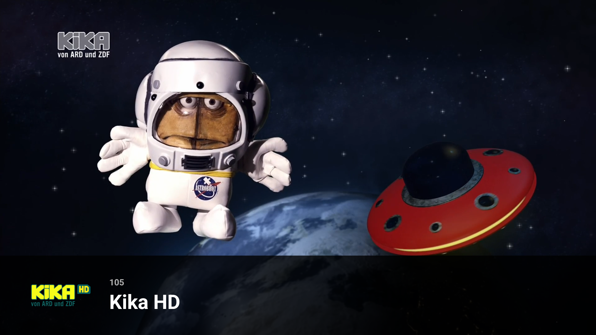
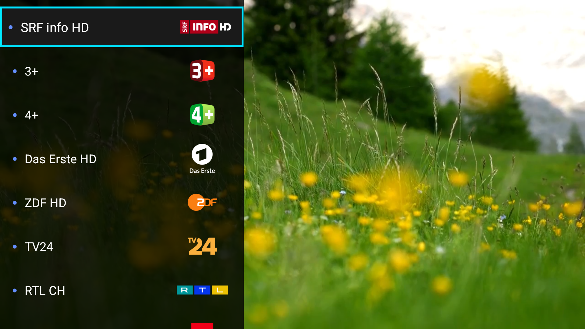
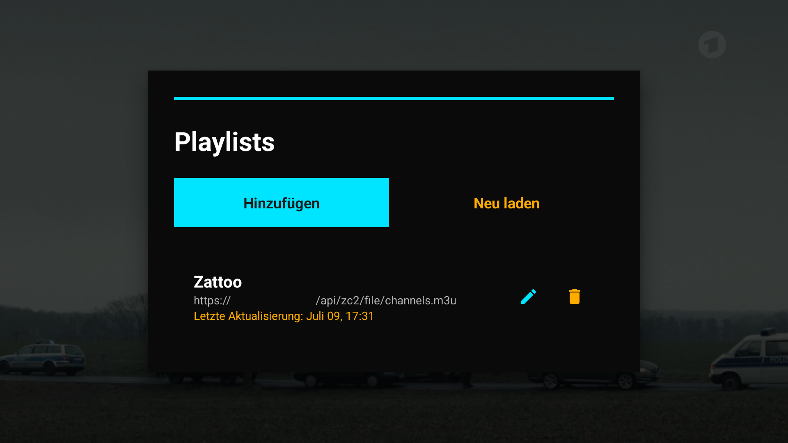
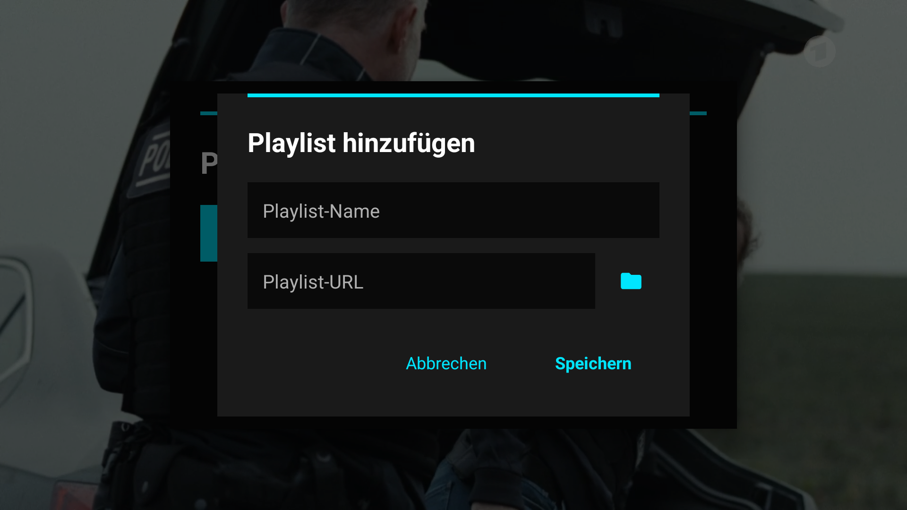

# ZapperIPTV

ZapperIPTV is a straightforward IPTV player built for Android TV. The goal is to keep things simple and fast,
focusing on a basic channel-surfing experience.

[![Downloader Code](https://img.shields.io/badge/5853864-svg?logo=data:image/svg%2bxml;base64,PHN2ZyByb2xlPSJpbWciIHZpZXdCb3g9IjAgMCAyNCAyNCIgeG1sbnM9Imh0dHA6Ly93d3cudzMub3JnLzIwMDAvc3ZnIj4KICA8dGl0bGU+RG93bmxvYWRlcjwvdGl0bGU+CiAgPHBhdGggZD0iTSAzLjQ1IDE4LjE2CiAgICAgICAgICAgQyA0LjYyIDE5LjIyLCA1Ljc0IDIwLjMzLCA2LjkgMjEuNDIKICAgICAgICAgICBDIDguMDUgMjAuMzMsIDkuMTggMTkuMjIsIDEwLjM1IDE4LjE2CiAgICAgICAgICAgQyAxMS45NCAxOC4wOCwgMTMuNjUgMTguMzAsIDE1LjE0IDE3LjYzCiAgICAgICAgICAgQyAxNi4zMiAxNy4wMywgMTYuODEgMTUuNjgsIDE2Ljk3IDE0LjQ0CiAgICAgICAgICAgQyAxNy4wOSAxMi40OSwgMTcuMjUgMTAuNDYsIDE2LjY1IDguNTcKICAgICAgICAgICBDIDE2LjI3IDcuMTIsIDE0Ljk5IDYuMjYsIDEzLjY1IDYuMDQKICAgICAgICAgICBDIDEyLjU2IDUuODgsIDExLjQ1IDUuODcsIDEwLjM1IDUuODcKICAgICAgICAgICBWIDEyLjcKICAgICAgICAgICBIIDEzLjgKICAgICAgICAgICBMIDYuOSAxOS4yCiAgICAgICAgICAgTCAwIDEyLjcKICAgICAgICAgICBIIDMuNDUKICAgICAgICAgICBWIDAuOAogICAgICAgICAgIEMgNy40NCAwLjgyLCAxMS40NCAwLjc1LCAxNS40MiAwLjg0CiAgICAgICAgICAgQyAxOC4yOCAwLjk5LCAyMS4xMiAyLjQ4LCAyMi40OSA1LjA1CiAgICAgICAgICAgQyAyMy45NCA3LjUxLCAyNC4wNiAxMC40MywgMjMuOTggMTMuMjEKICAgICAgICAgICBDIDIzLjk5IDE2LjA0LCAyMy4wOCAxOS4wMiwgMjAuODggMjAuOTAKICAgICAgICAgICBDIDE5LjY2IDIyLjE1LCAxNy45MyAyMi42NywgMTYuMjYgMjIuOTcKICAgICAgICAgICBDIDE0LjY4IDIzLjMzLCAxNC4wNSAyMy4yMCwgMTEuNDAgMjMuMjAKICAgICAgICAgICBDIDguNzQgMjMuMjEsIDYuMTEgMjMuMTgsIDMuNDUgMjMuMjAKICAgICAgICAgICBaIiAgZmlsbD0iI2ZmZmZmZiIvPgo8L3N2Zz4=&style=for-the-badge&labelColor=F37623&color=gray)](https://play.google.com/store/apps/details?id=com.esaba.downloader)

## How it works

### Simple Playback
The player is designed to stay out of the way. You can switch between channels quickly with your remote.

  

### Channel Sidebar
There is a sidebar that lets you look through your channel list while you're still watching something.

  

### Playlist Management
You can add and manage multiple M3U playlists. It's built for D-pad use, so it's easy to navigate with a remote.

  
  

## Features

- **Built for TV**: Works with your remote's D-pad.
- **Quick Switching**: Aiming for minimal delay when changing channels.
- **Format Support**: Uses Android's Media3 to support HLS, DASH, and RTSP.
- **Home Screen**: Recently watched channels can show up on the Android TV home screen.

## Device Compatibility

ZapperIPTV is made for Android TV. It will run on phones and tablets, but since it's designed for remotes,
the touch experience isn't perfect.

## Getting Started

### Installation

1. Get the latest APK from the [Releases](https://github.com/Double-A-92/ZapperIPTV/releases) page.
2. Sideload it onto your TV (Android TV or Fire TV).

### Adding Content

You'll need to provide your own M3U playlists. ZapperIPTV doesn't come with any content.
- Long-press the **[OK/Center]** button to open the playlist menu.
- Choose **Add Playlist** and paste your URL.

## AI Disclaimer

This app was developed with some help from AI tools to help with the code and UI.
